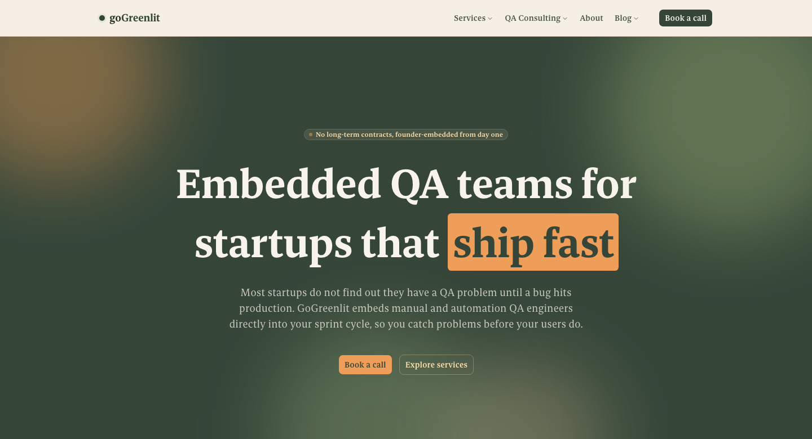
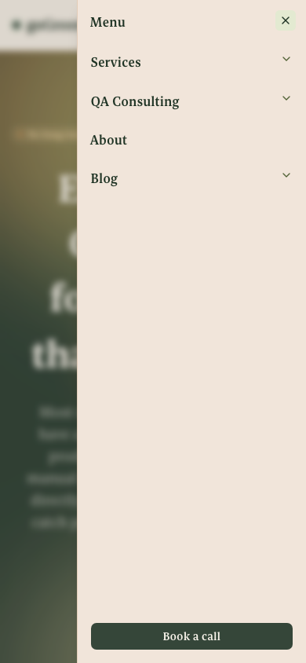
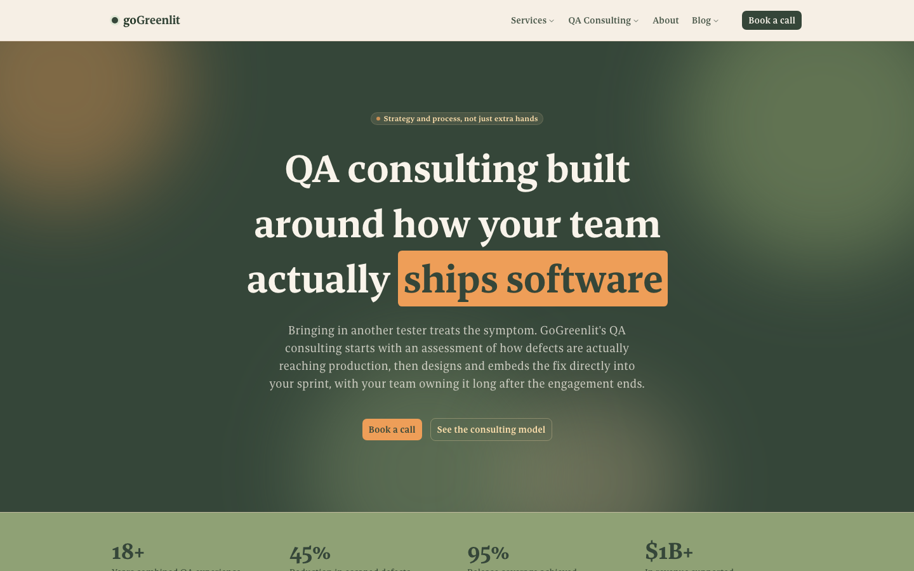
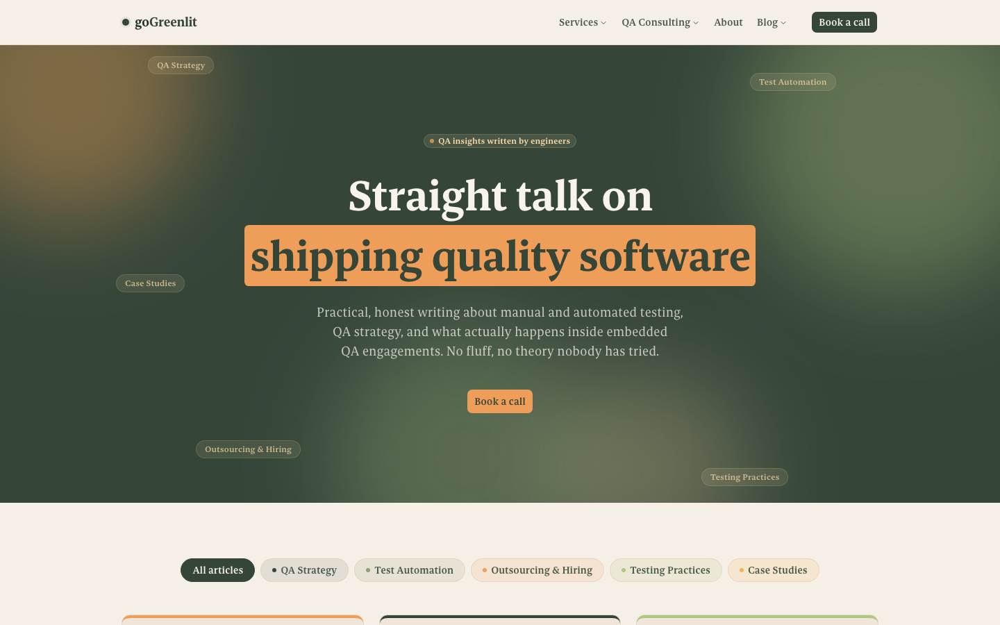

# GoGreenlit

**A production marketing + content site, live at [gogreenlit.com](https://www.gogreenlit.com).**

Built solo with Next.js 16, TypeScript, and Tailwind CSS v4. 17 hand-built
page templates plus a templated blog engine generating 40 long-form
posts, 57 total indexed routes, full technical SEO (structured data,
sitemaps, redirects), a custom scroll-driven animation system, and a
CI/CD pipeline that gates every merge on lint, typecheck, unit tests,
a production build, and end-to-end tests.

[](https://www.gogreenlit.com)


[](https://github.com/MuhammadAli0297/goGreenlit/actions)

<p align="center">
  
  <br />
  <sub>Homepage hero: animated aurora background, always fills exactly one viewport</sub>
</p>

<p align="center">
  
  <br />
  <sub>Mobile hamburger nav drawer</sub>
</p>

<p align="center">
  
  
  <br />
  <sub>QA Consulting, a visually distinct page family&nbsp;&nbsp;·&nbsp;&nbsp;Blog index with category color coding</sub>
</p>

## What this project is

GoGreenlit is my own company's real marketing site: embedded QA
consulting (manual + automation testing) for startups. I own it end to
end, product, design system, content, and infrastructure, and it has
been rebuilt and iterated on in public production, not as a portfolio
demo. I'm including it here because it demonstrates how I actually work:
deliberate architecture decisions, a real content and SEO strategy
executed at scale, and a testing/CI discipline I hold myself to without
anyone requiring it.

A few things worth a closer look if you're evaluating this as engineering work:

**A multi-family design system, not one template reskinned.** The site
has four visually distinct "families" (Software Testing Services, QA
Consulting, About, Blog), each with its own accent color and
composition devices, sharing one token system, one animation
vocabulary, and one component library underneath. See
[`BRAND_GUIDELINES.md`](./BRAND_GUIDELINES.md) §4 and §9 for the actual
rules (including two color pairings I measured for contrast, tried, and
rejected before landing on what's live).

**A hand-rolled scroll animation system, not an animation library.**
Three distinct techniques, chosen deliberately per use case: CSS
keyframes for ambient bold-section motion, `IntersectionObserver`-based
reveal-on-scroll for everything else (so nothing animates while
off-screen), and `requestAnimationFrame`-throttled scroll listeners that
write directly to the DOM via refs for continuous scroll-linked effects
like the hero's shrink-on-scroll, bypassing React re-renders entirely
for performance. Every animation has a `prefers-reduced-motion`
fallback.

**A typed content model instead of a CMS.** All 40 blog posts live as
structured TypeScript data (`src/lib/blog-data.ts`), not MDX or a
headless CMS, a deliberate choice after trying MDX and removing it. Post
bodies are a discriminated union of content blocks (`paragraph`,
`heading`, `subheading`, `list`) rendered by one dumb mapper component,
which keeps every post page a React Server Component with zero client
JS for content rendering. A lightweight `[label](/path)` inline-link
syntax (not real markdown, a ~20-line shared parser) powers real
in-content and FAQ linking without pulling in a markdown dependency.

**Real technical SEO, not an afterthought.** Every non-home route emits
its own `BreadcrumbList` JSON-LD; relevant pages add `FAQPage`,
`BlogPosting`, or `ProfessionalService` structured data on top of that;
`next.config.ts` carries permanent redirects mapping dead URLs from a
prior site rebuild to their closest current equivalent, based on a diff
against the old site's file tree, not guesswork. Every blog post follows
a repeatable content structure (a direct-answer heading for featured
snippets, 5-8 real internal links spread across the body and an FAQ
section, no fabricated stats or invented case details) documented as a
standing process in [`CLAUDE.md`](./CLAUDE.md), not applied once and
forgotten.

**CI/CD that actually gates.** Every PR runs lint, a Prettier format
check, a strict TypeScript typecheck, the full Vitest suite, a
production build, and a Playwright end-to-end suite before it can merge.
`main` deploys to Vercel automatically; nothing reaches production
without going through a branch and a pull request first.

## How this was built

This project is built in an agentic workflow with **Claude Code**, and
I'm noting that here on purpose rather than leaving it implied. Every
architecture decision, every design system rule, every SEO and content
strategy call in this repo was mine, made deliberately and often after
weighing real tradeoffs, not generated and accepted blindly. The part
that changed is execution speed: I can direct an agent through a full
feature, a content rewrite, or a technical SEO audit, review its output
critically, and catch what it gets wrong, which is exactly the same
judgment a QA engineer applies to any code they didn't write themselves.
A couple of concrete examples that shipped this way: I caught a real bug
where an in-content link parser was added to one component but silently
missed on a second one, three FAQ links were rendering as dead text
until I noticed and had it fixed; and the entire git history, CI
pipeline, and dev-then-prod deploy discipline you can see in this repo
reflects decisions and approvals I made at every step, nothing merges or
deploys without my explicit go-ahead. `CLAUDE.md` itself, technically
written as standing instructions for the agent, is really a live
engineering spec I maintain: every non-obvious decision and every bug
hit along the way gets documented there so it doesn't get relitigated or
reintroduced later.

## Stack

| Layer      | Choice                                                           |
| ---------- | ---------------------------------------------------------------- |
| Framework  | Next.js 16 (App Router, Turbopack, React Server Components)      |
| Language   | TypeScript, `strict` plus extra strictness flags                 |
| Styling    | Tailwind CSS v4 (CSS-first config, no `tailwind.config.ts`)      |
| Components | shadcn/ui on [Base UI](https://base-ui.com) (not Radix)          |
| Testing    | Vitest + React Testing Library (unit), Playwright (e2e)          |
| Tooling    | ESLint (flat config), Prettier, Husky + lint-staged + commitlint |
| Deploy     | Vercel, auto-deployed from `main`                                |

## By the numbers

- **17** hand-built page templates across 4 distinct page families, plus
  a blog engine generating **40** long-form posts, **57** total indexed
  routes
- **20** unit tests and a **3**-scenario Playwright end-to-end suite,
  both required to pass in CI before merge
- **Zero** runtime animation dependencies, every motion effect is pure
  CSS or a native browser API
- **~72KB** internal engineering doc (`CLAUDE.md`) documenting every
  non-obvious architectural decision and gotcha hit along the way, kept
  current as the source of truth for how the codebase actually works

## Getting started

Requires Node.js 24 (see `.nvmrc`, run `nvm use` if you use nvm).

```bash
npm install
npm run dev
```

Open [http://localhost:3000](http://localhost:3000).

One-time setup if you'll run the end-to-end suite locally:

```bash
npx playwright install chromium
```

## Common commands

| Command             | What it does                  |
| ------------------- | ----------------------------- |
| `npm run dev`       | Start the local dev server    |
| `npm run build`     | Production build              |
| `npm run start`     | Serve the production build    |
| `npm run lint`      | ESLint                        |
| `npm run format`    | Prettier (write)              |
| `npm run typecheck` | TypeScript, no emit           |
| `npm run test`      | Unit tests (Vitest)           |
| `npm run test:e2e`  | End-to-end tests (Playwright) |

## Project structure

```
src/app/            Routes (App Router): home, software-testing-services/
                     and its six subpages, qa-consulting/ and its six
                     subpages, about/, and blog/ (index + [slug] posts)
src/components/      ui/ (shadcn, generated) · layout/ · marketing/
src/lib/             Site config, blog content/data, cross-link and
                     breadcrumb schema helpers, utilities
next.config.ts       Redirects for dead URLs from the pre-rebuild site
e2e/                 Playwright specs
```

For the full breakdown, every route's purpose, every component's
responsibility, and the reasoning behind non-obvious decisions, see
**[CLAUDE.md](./CLAUDE.md)**. It's the internal engineering doc I write
and maintain for this project, and it's public here deliberately: it's
as much a demonstration of how I document and reason about a codebase as
the code itself. For voice, tone, and the color/design system rules, see
**[BRAND_GUIDELINES.md](./BRAND_GUIDELINES.md)**.

## Environment variables

Copy `.env.example` to `.env.local` and adjust as needed. See that file
for what each variable does.

## Deployment

Configured to deploy to Vercel with zero additional setup, connect the
repository and it builds with `npm run build`. CI
(`.github/workflows/ci.yml`) gates `main` on lint, format, typecheck,
unit tests, a production build, and Playwright e2e tests before any
merge.
